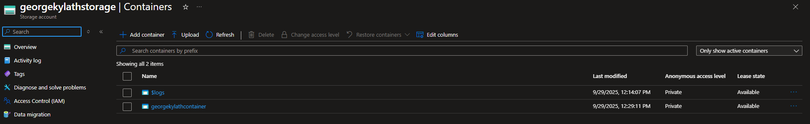
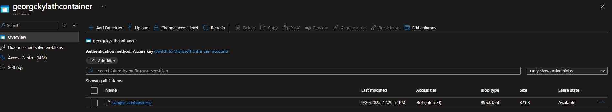
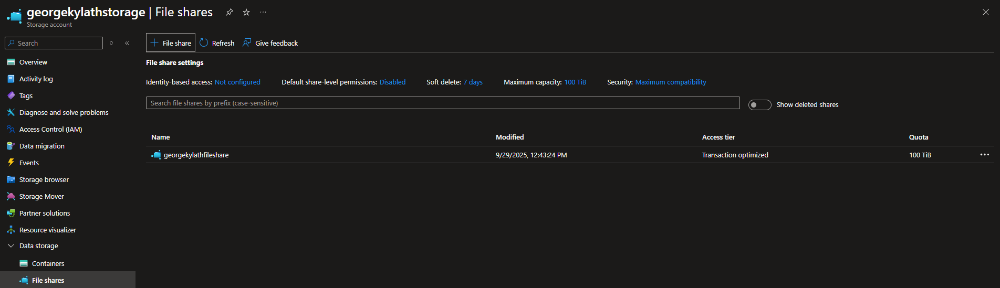
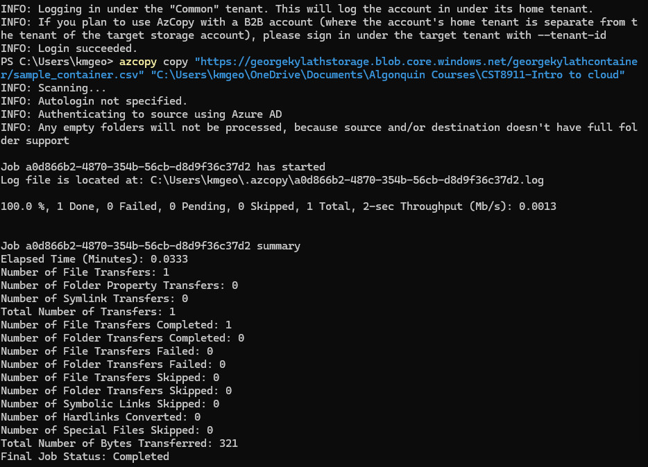
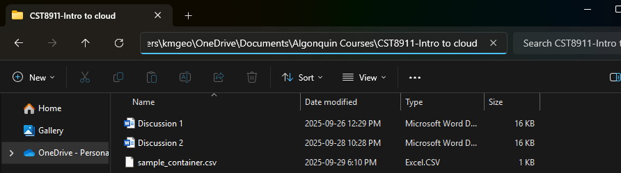

# CST8911: Lab 1

## Name: Kylath Mamman George

## Student Number: 041198835

### Step 1

Policy error when choosing US East region(chose Canada central instead):

Storage Account overview:

### Step 2

Container created:

csv file has been added to container:

### Step 3

File share created:

### Step 4

**NOTE: I kept getting permissions error no matter what I did, so I solved it by giving myself the role of "Storage Blob Data Owner" in the Access Control for the container.**

azcopy command with output:

File explorer screenshot:

### Step 5

Account SAS token generated:

Upload command + successful output:

Azure portal file share with uploaded file:

### Step 6

My current IAM settings:

### Step 7

Select "Reader" role using the add role option, has the description of "View all resources, but does not allow you to make changes":

Selecting myself to add role:

Review:

Reader role added:

### Step 8

Resource Deletion:

Deletion confirmed:

