# CST8911: Lab 2

## Name: Kylath Mamman George

## Student Number: 041198835

## Policy Error

I get this policy error using East US regions, so I will be using Canada Central or other regions to do this lab if necessary.

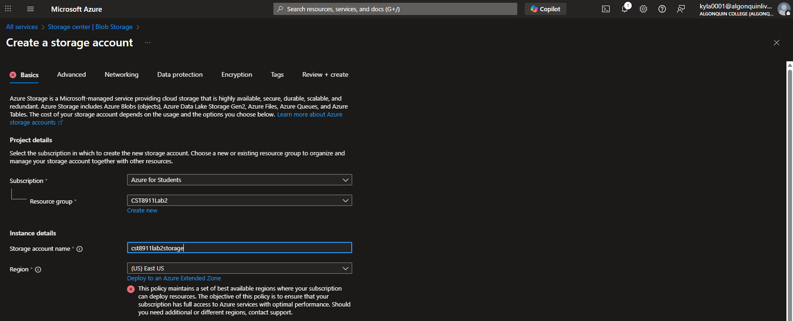

### Step 1

Storage Account Overview:

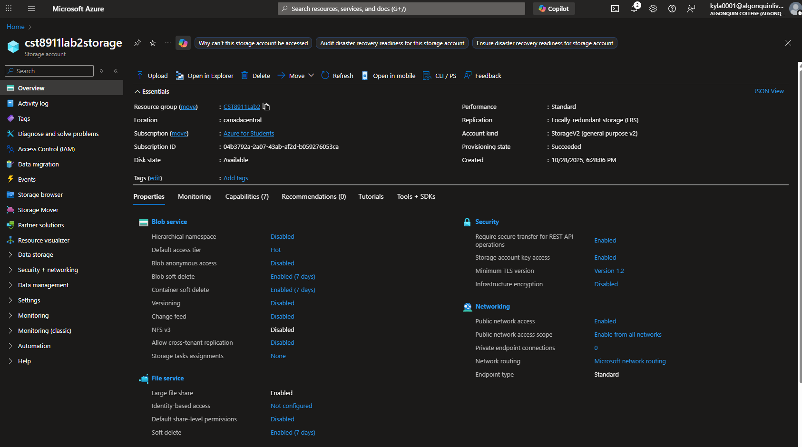

### Step 2

Function app settings chosen:

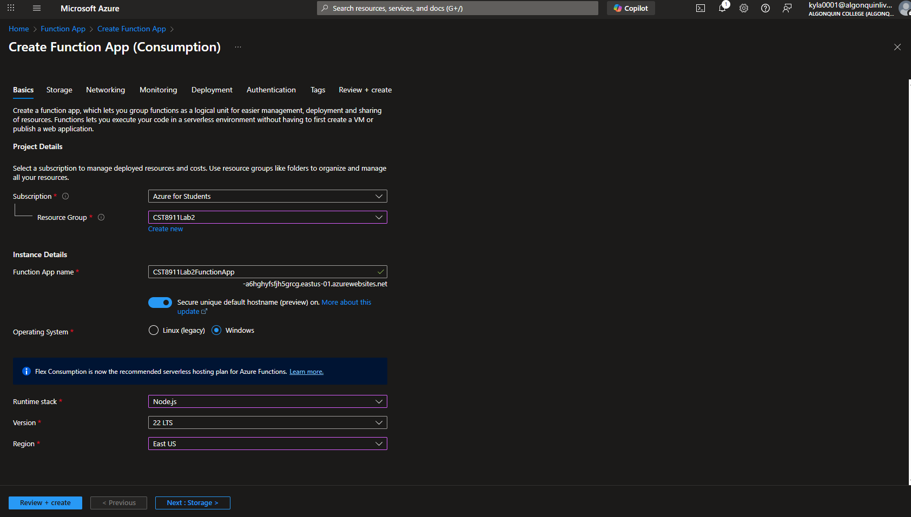

### Step 3

Azure Blob Storage Trigger chosen:

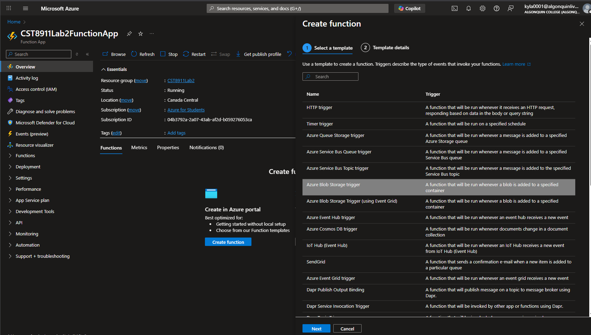

Storage account from Step 1 chosen(I had to use the create new option to choose my storage account):

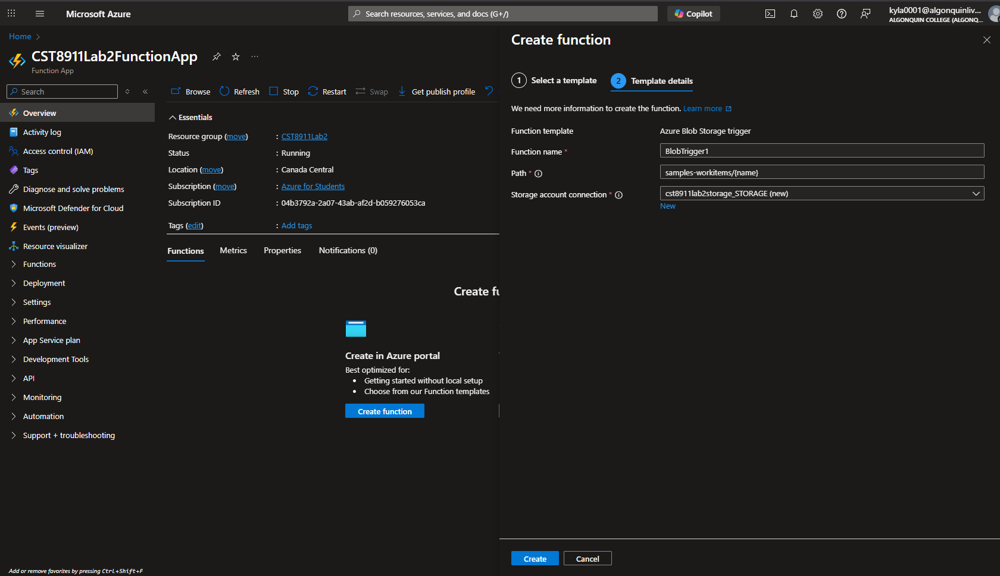

Container "cst8911lab2congtainer" created in the storage account

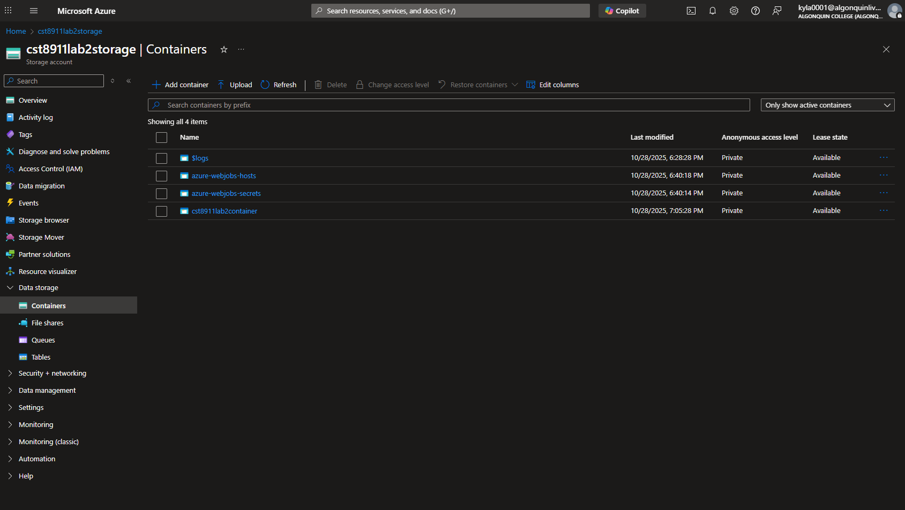

BlobTrigger1 created:

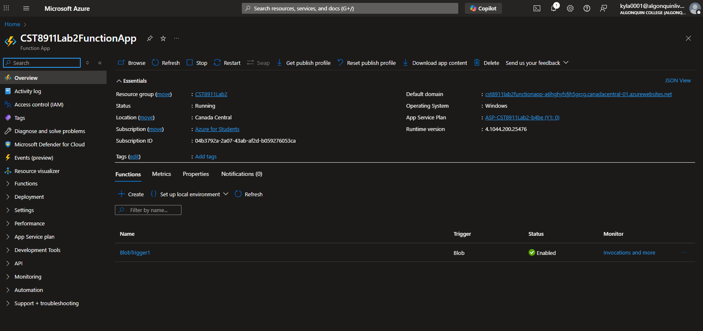

### Step 4

**Note: I could not figure out how to use the "Test/Run" to manually test this specific trigger. I have used it in the past for HTTP triggers but nothing I tried seemed to work for this function. I am aware it is a useful tool to use to test, maybe I am missing something obvious here, however I can see that the trigger works with the following screenshots. In the code, I output some log statements, showing the file name and file size which match the output in the logstream provided. In function.json, the path of the container being monitored is also provided and matches my container name in my storage account.**

**I tried to do some research on this because the Azure Blob Storage trigger seems to be event driven and again maybe I am missing something simple but this article seems to point to non-HTTP triggers requiring a second trigger to simulate a blob being uploaded(?): <https://learn.microsoft.com/en-us/azure/azure-functions/functions-manually-run-non-http?tabs=azure-portal>.**

Screenshot of the code of the function:

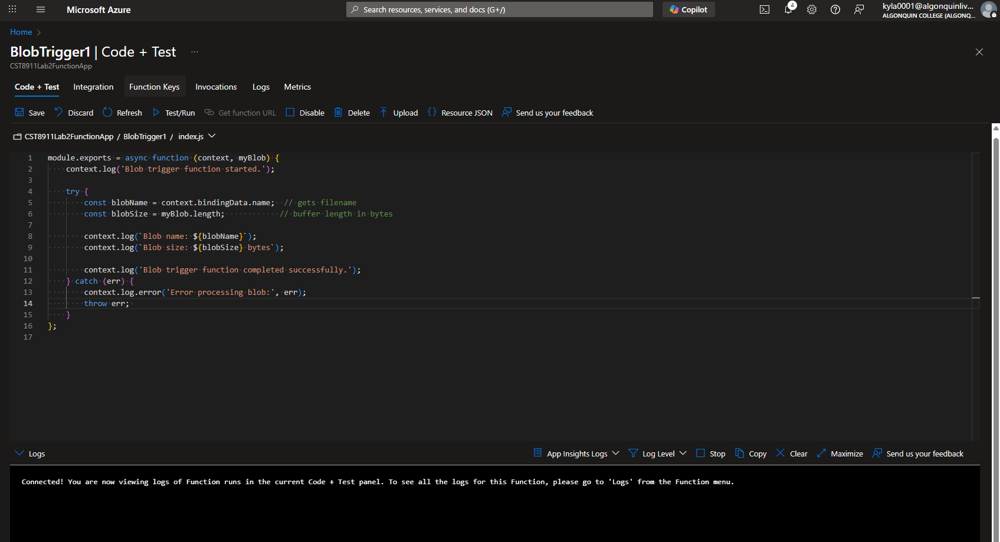

Screenshot of function.json:

AzureWebJobsStorage is the connection to the container specified in function.json.

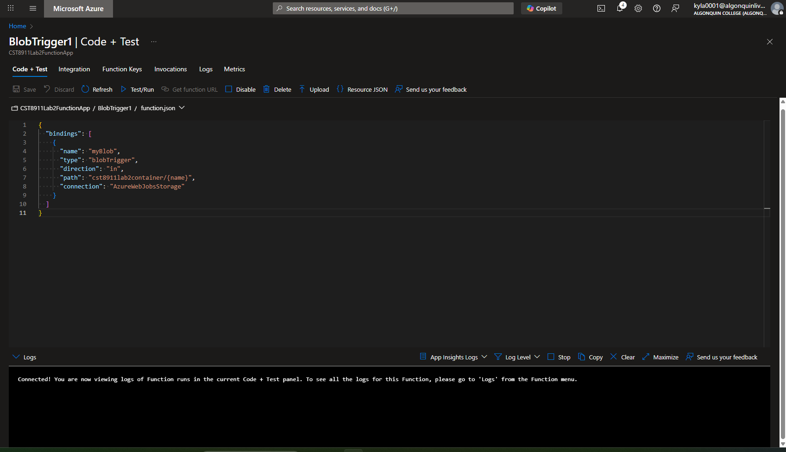

Screenshot of the uploaded file in the container:

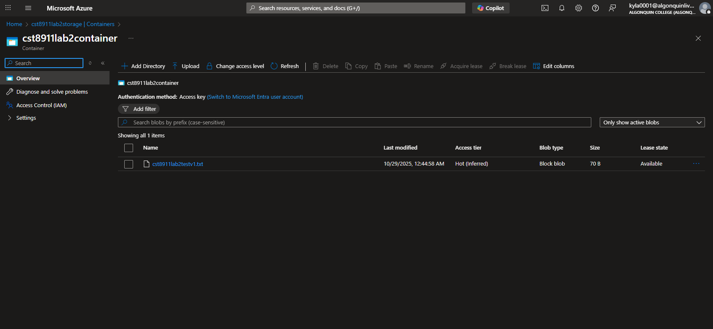

Screenshot of the output from logstreams in Monitoring:

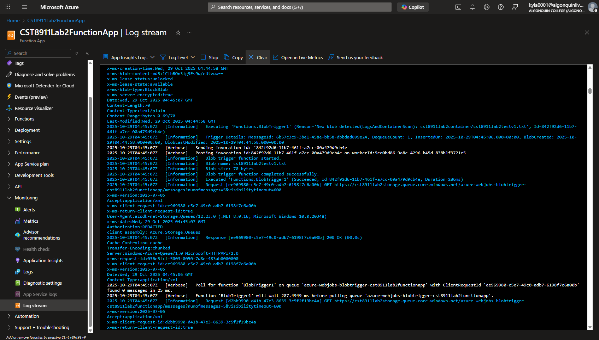
