# CST8911: Lab 4

## Name: Kylath Mamman George

## Student Number: 041198835

## Cannot create Automation account in any region

Error creating Automation account:

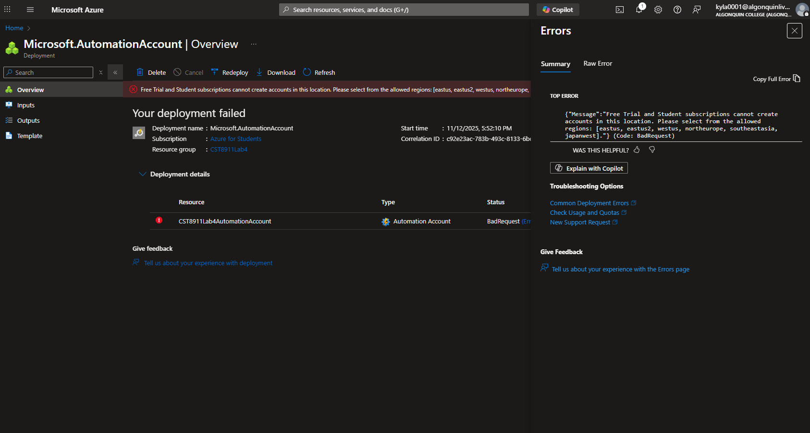

Error with using West US:

Error with using Japan West:

Error with East US;

Error with East US 2:

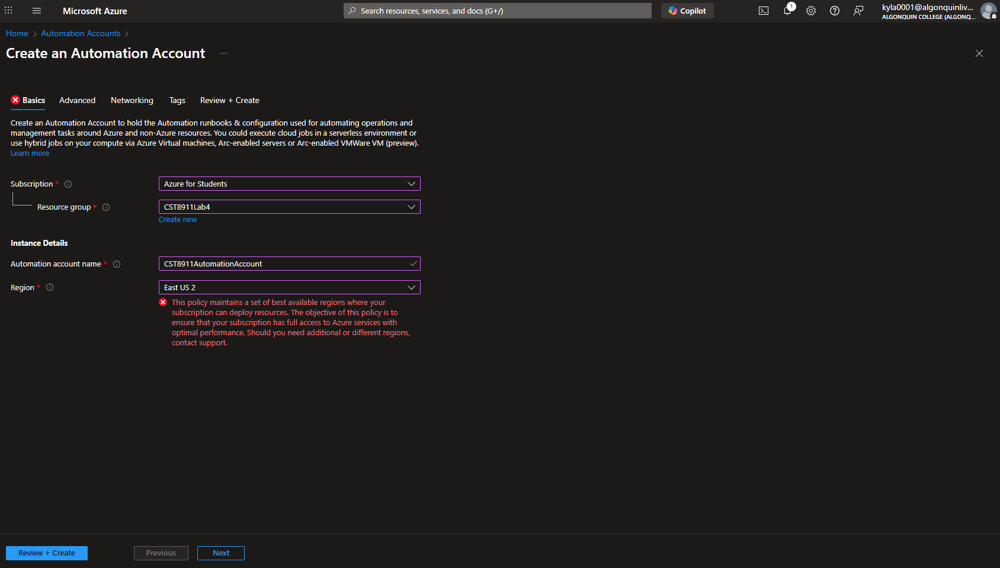

Error with North Europe:

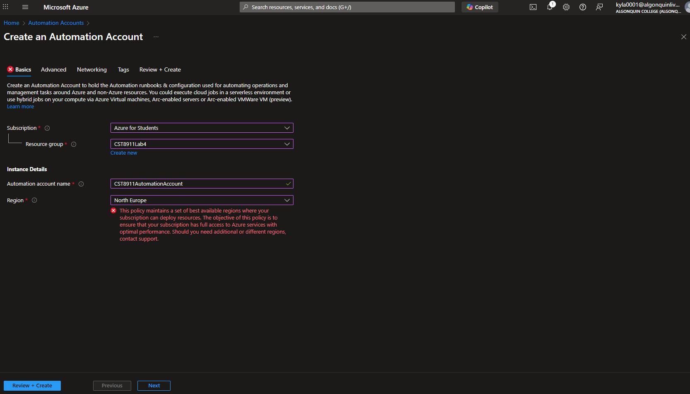

Error with Southeast Asia:

## Step 1

### Github Repository Link: <https://github.com/KylathGeorge/CST8911Lab4/tree/main>

Screenshot of html content in repo:

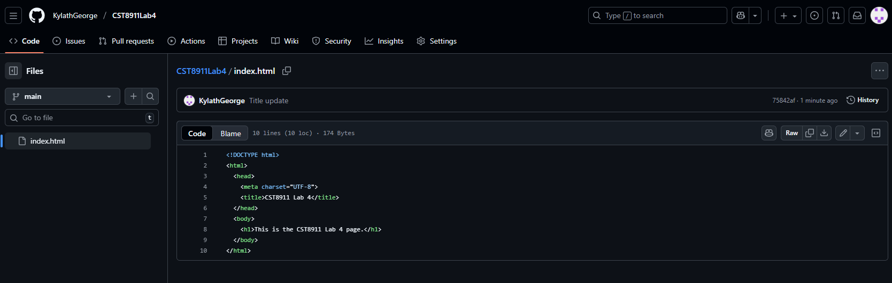

Screenshot of the repository:

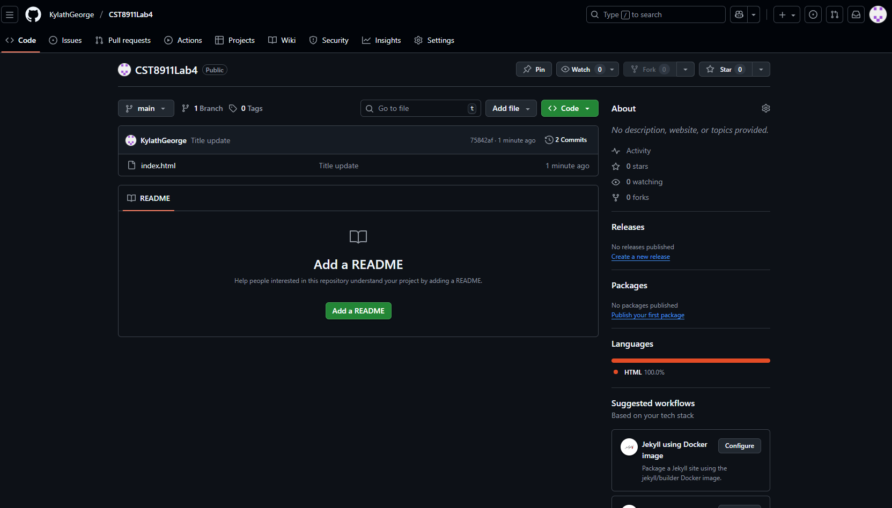

## Step 2

Creation of static web app:

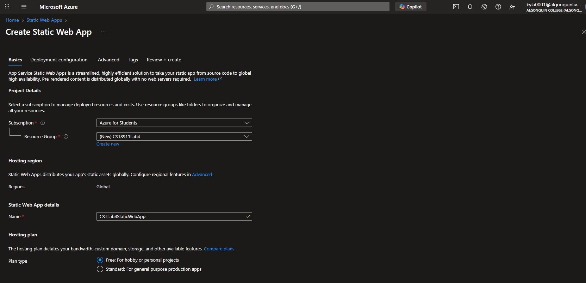

repo details:

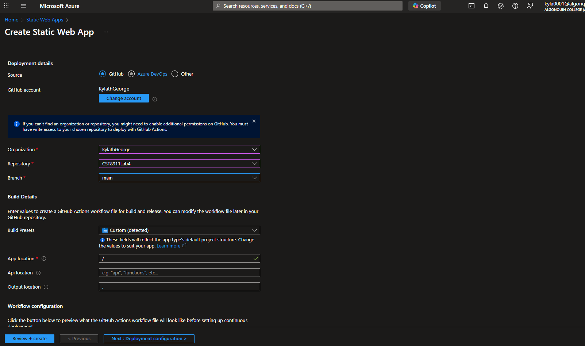

Overview:

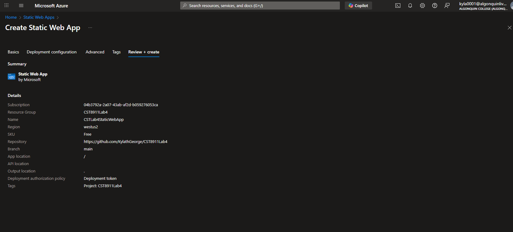

Resource Overview:

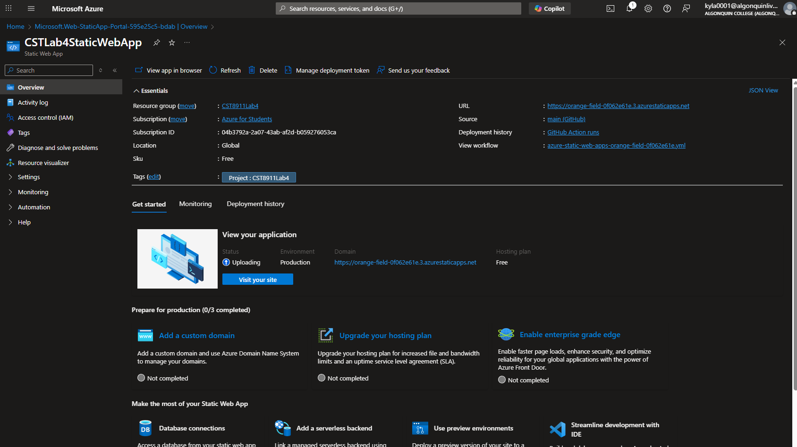

## Step 3

Github workflow file added:

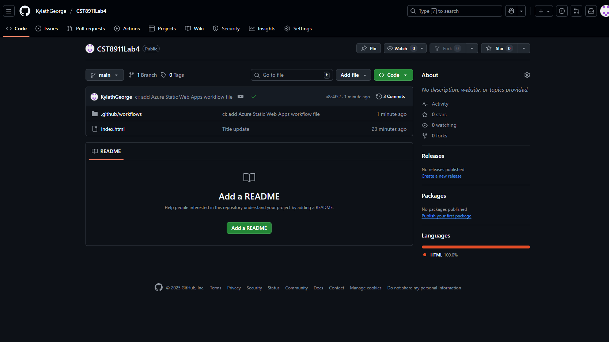

Content of .yml file:

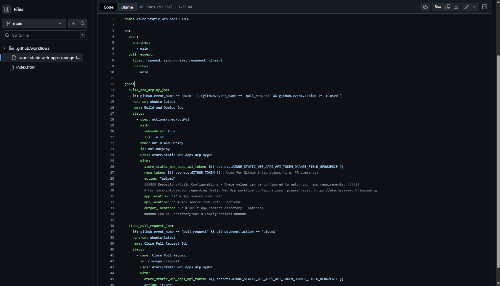

## Step 4

Screenshot of the site:

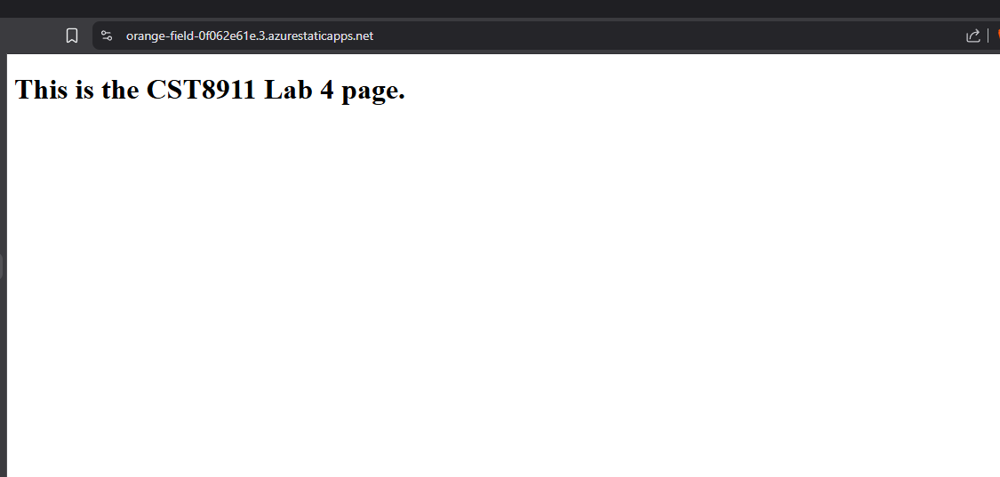

## Step 5

Updated html file from "This is the CST8911 Lab 4 page" to "This is the UPDATED CST8911 Lab 4 page":

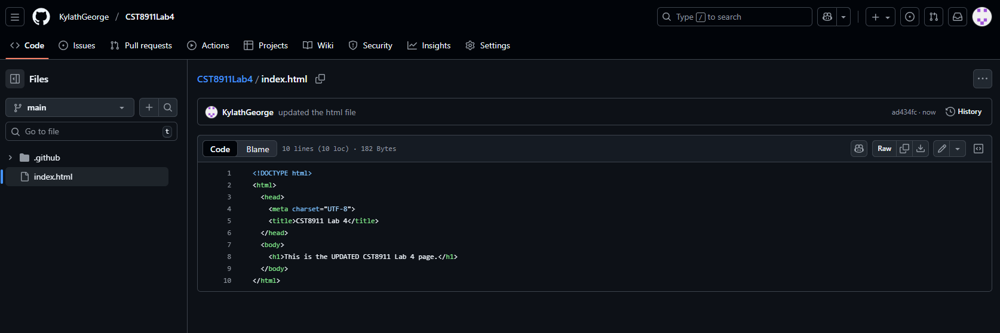

## Step 6

Screenshot of the updated site:

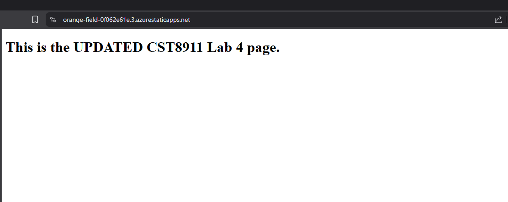

## Step 7

Resources deleted:

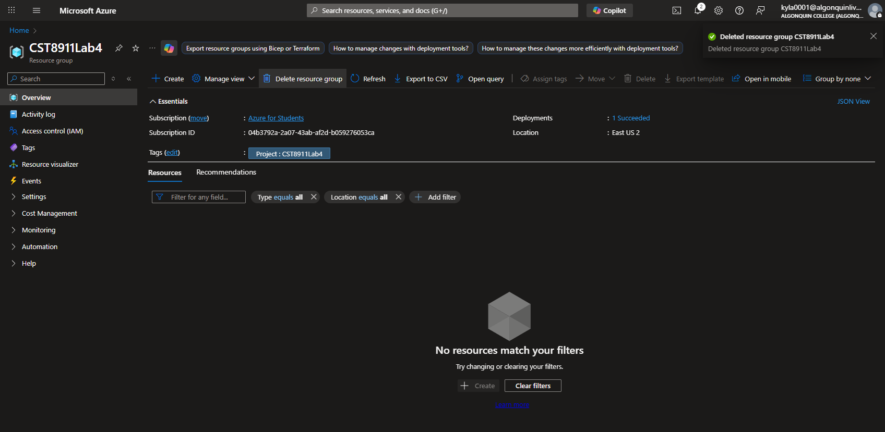