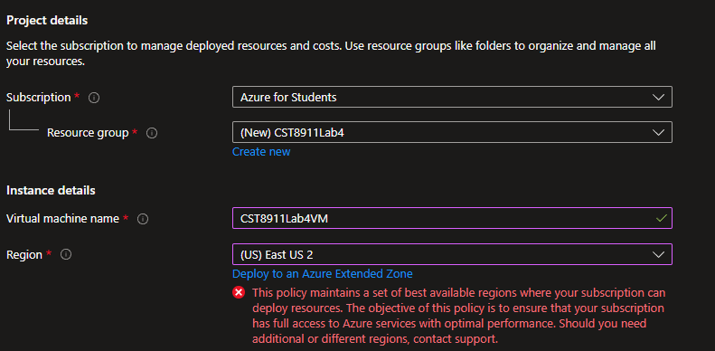
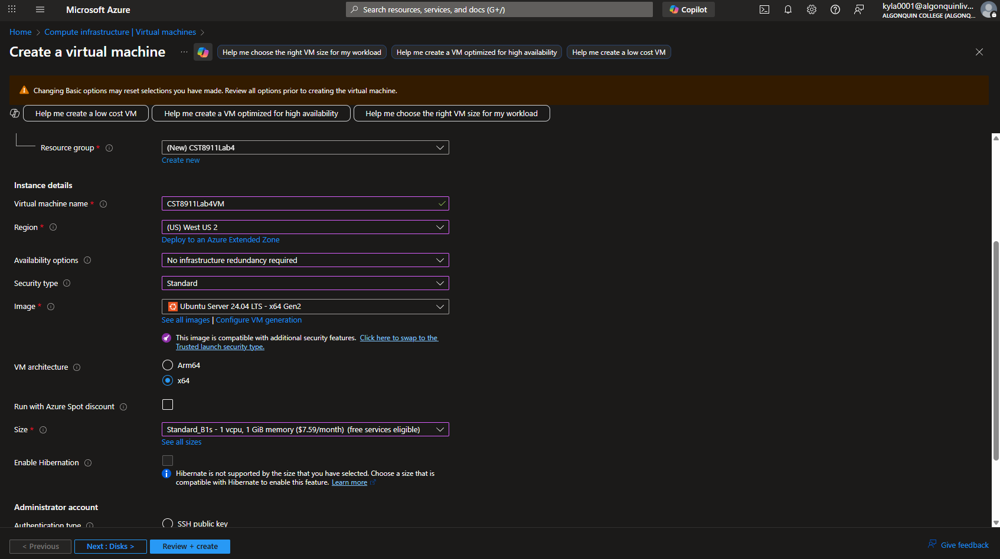
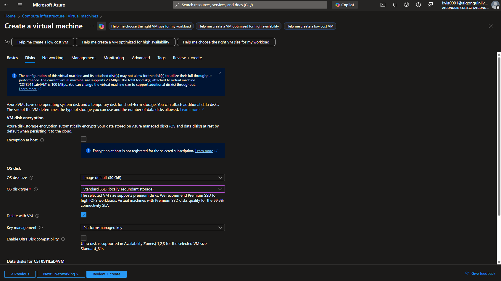
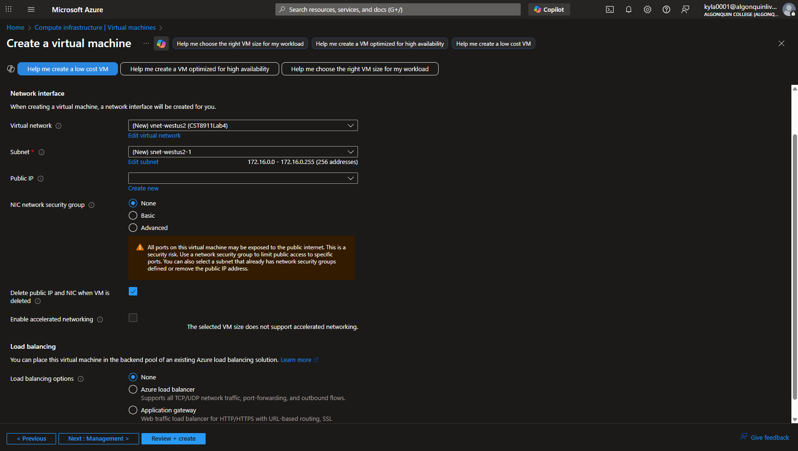
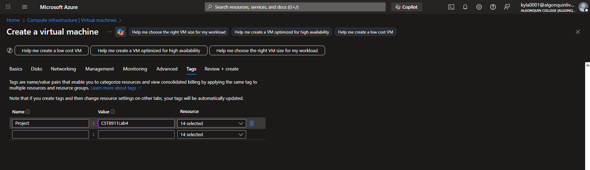
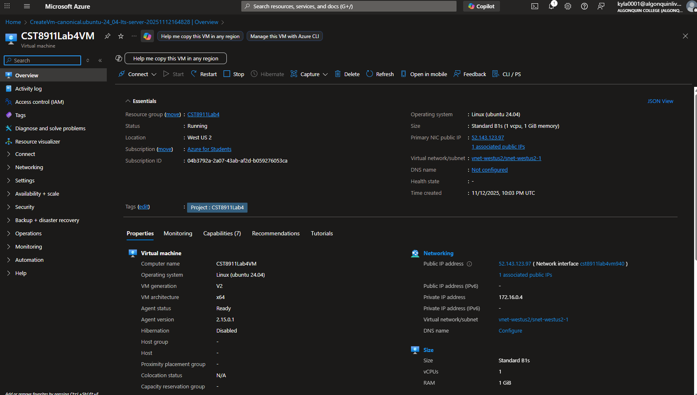
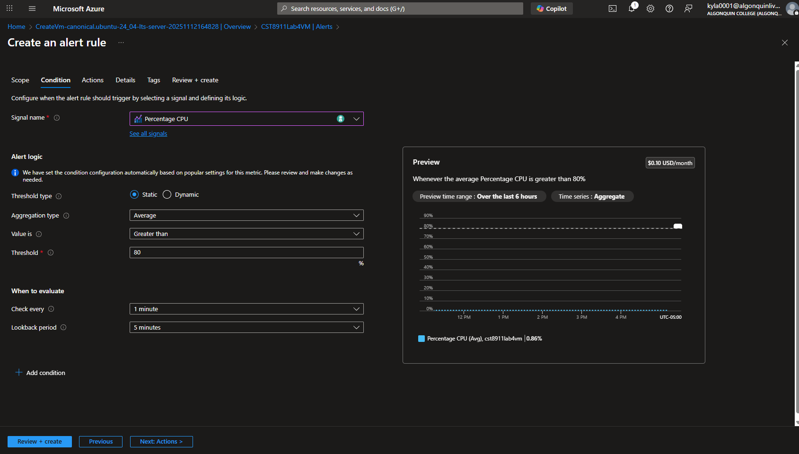
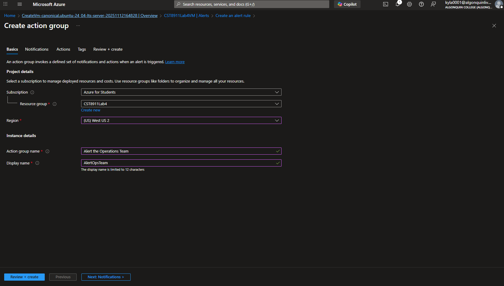
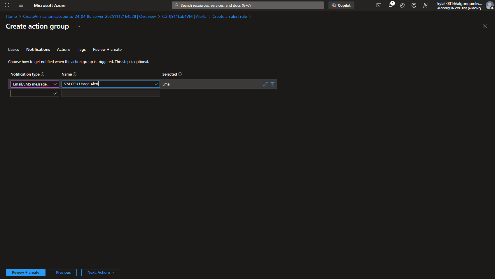
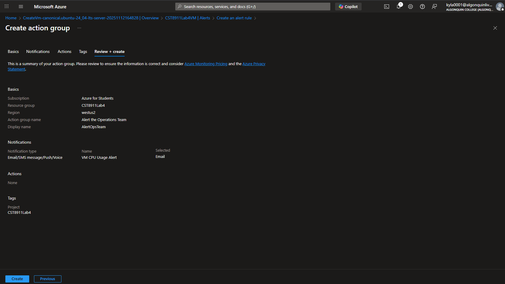

# CST8911: Lab 4

## Name: Kylath Mamman George

## Student Number: 041198835

## Step 1

Policy error choosing East US 2 region:

Settings Basics:

Settings Disks:

Settings Networking:

Settings Tags:

VM Overview:

## Step 2

Creating an Alert rule with Percentage CPU condition:

Creating Action Group Basics:

Creating Action Group Notifications:

Creating Action Group Overview:

